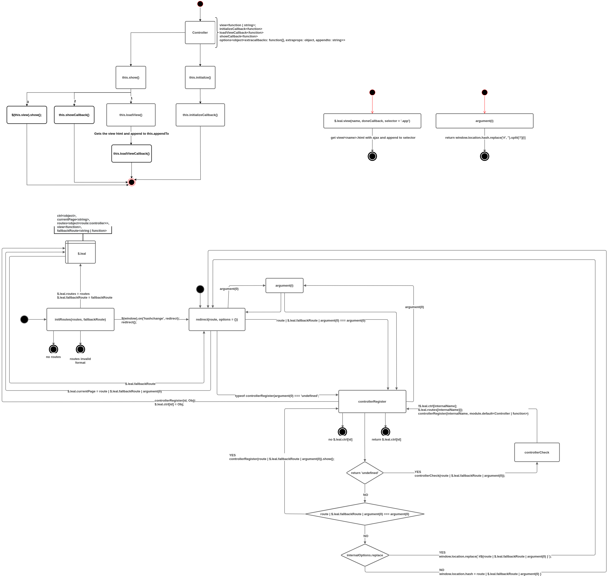

# LEALJS


## Description
The LealJS is a simple Single Page App (SPA) framework based on jQuery.

The main purpose is to serve html views according to the routes associated with Controllers.

The view is changed when the window `hashchange` event is triggered.

The framework works showing and hidding the views in the DOM. To this, all html views must contain the class '.all-views' in the root element.

When the `hashchange` event is triggered, all views are hidded and only the view of current route is showed.

This is the diagram of the framework:



___

### initRoutes
The entrypoint of the framework is a map between routes and controllers, like the following one.

```javascript
  const routes = {
    'products': productsController,
    'products.find': findProductController,
    'cart': cartControllers
  }
```
If the route has parameters like `products/find/<id>`, you don't need to put they in this map. You will be able to get the params inside the controller using the [argument](#argument) helper function.

The routes will be transformed following this pattern: `products.find -> products/find`.

If you are using `>=2.0` version, you must pass the view as a html string or as a function that returns a html string to [Controller](#the-controller-class) constructor. Else, you could still using the `$.leal.view()` helper function with a controller funcion. This is a deprecated method.

If you are using webpack, look the `html-loader`. This will allow you to import the views files like this:

```javascript
  const view = () => import('@/views/products/index.html');
```
Make sure that you have `babel-plugin-syntax-dynamic-import` in your `.babelrc` file.

The routes map needs to be passed as parameter to the `initRoutes` function.

```javascript
  // app.js
  // ...
  import initRoutes from 'lealjs'
  // ...
  initRoutes(routes, fallbackRoute);
```

The `fallbackRoute` of `initRoutes` is a route (string or a function that returns a string) to be used in [redirect](#redirect) when no route is passed as param or there is no current route.

This can be used as the first route for the user. For example:

```javascript
  // app.js
  // ...
  import initRoutes from 'lealjs'

  const user = {
    getInitialPage() {
      if (user.type === 'A') {
        return 'page.a'
      }
      return 'page.x'
    }
  }
  // ...
  initRoutes(routes, user.getInitialPage.bind(user));
```

___
### redirect

The `redirect(route, options)` function is a core function of the framework but can be used inside controllers to navigate between pages. It's responsible to handle the `hashchange` event and check if the controller has ever been instantiated. If it's true, call the controller's [controllerRegister(route).show()](#controllerRegister) function. If not, register the controller with the [controllerCheck(route)](#controllerCheck).

The second param is an object that could contain the `replace: true` option. This will change the `window.location` method inside `redirect`. If true, `window.location.replace(`#${route}`);` will be called. Else, `window.location.hash = route;` will do the job.

___
### controllerRegister

This is the heart of LealJS. This function is a core function but can be used inside the controllers to get an external controller method or property.

The `controllerRegister` receives two params, the `route` of the controller wich is the route (eg.: `products.find`) and a controller that could be a LealJS 1.0 controller function or a [Controller](#the-controller-class) class instance.

This function always return the registered controller.

* If no `route` is provided, the return is the `current controller`;
* If no controller is provided, the return is the `route controller`;
* If the controller is an instance of [Controller](#the-controller-class), the controller will be registered and returned;
* If the controller is a function, their methods will be binded to himself and the controller will be registered, his `initialize` method will be called and the controller will be returned;
* If there no controller with thad `route` an error is thrown.

___

### controllerCheck

This function receives a route and verify if the controllers was instatiated. If not, instatiate a new instance of the controller and call the [controllerRegister(route, instance)](#controllerRegister).

For performance reasons, the controller is intatiated only when the user goes to their route for the first time. The subsequents times, the framework uses the previous instance.

If the route isn't founded in the map, an error is trown.

___

### argument

This is a helper function that receives a index and returns the route parameter that corresponds to the index.

```javascript
  return window.location.hash.replace('#', '').split('/')[index]
```

___

### The Controller class

This is an evolution of the old controller function.

The class receive the following parameters:

```javascript
  import { Controller } from 'lealjs'

  const view = 'html string' // or a function that returns a html string
  const showCallback = function() {} // can't be a arrow function. Will be called after controller show() function.
  const initializeCallback = function() {} // optional - can't be a arrow function. Will be called after controller instatiation.
  const loadViewCallback = function() {} // optional - can't be a arrow function. Will be called after the controller loadView.
  const extraCallbacks = { a(){}, b(){} } // optional - extra funcions to complement the controller logic. If you pretend to use 'this' from the class inside a extraCallback don't use arrow functions.
  const extraProps = { x: 1, y: 2 } // optional - extra props to complement the controller logic.
  const appendTo = '.html_selector' // optional (default: .app) - the element where the constroller html view will be appended.

  new Controller(
    view,
    initializeCallback,
    loadViewCallback,
    showCallback,
    {
      extraCallbacks,
      extraProps,
      appendTo,
    },
  )
```

For performance reasons, the loadView function is called only when the controller `show` function is called. The same occurs to `showCallback()`.
